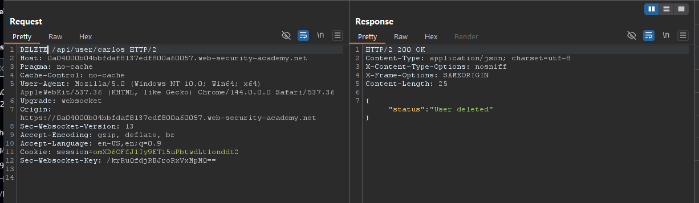
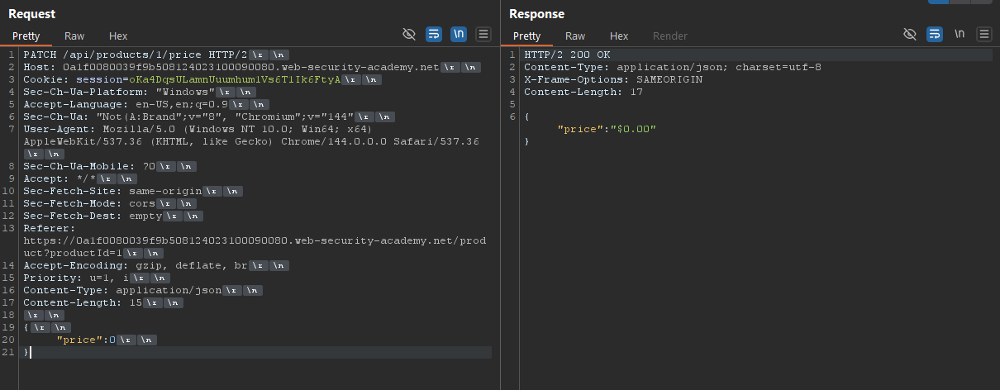
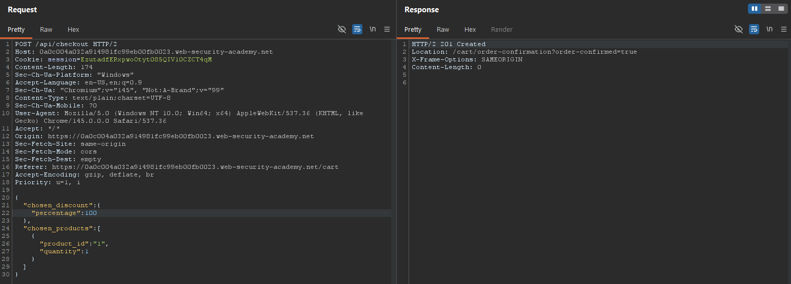
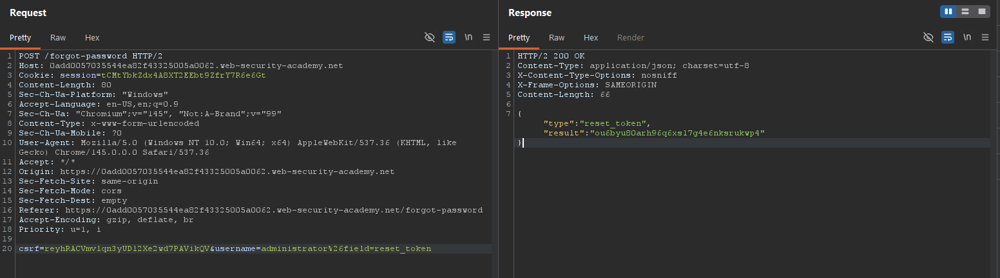

### API Testing Steps

#### API Reconnaissance
**Example API Request:**
GET /api/books HTTP/1.1
Host: example.com

**Techniques:**
* **Fuzzing:** We can use `/api/books/..` to search for more endpoints on the website.
* **Key Checks:**
    * The input data the API processes, including both compulsory and optional parameters.
    * The types of requests the API accepts, including supported HTTP methods and media formats.
    * Rate limits and authentication mechanisms.

---

#### API Documentation
APIs are usually documented so that developers know how to use and integrate with them. This documentation is often publicly available.

**Discovery Paths:**
To discover API documentation, check the following common locations:
* `/api`
* `/swagger/index.html`
* `/openapi.json`

> **Important:** Make sure to check the base path in API paths.

**Additional Discovery:**
* You can also use a list of common paths to find documentation using Intruder.

**Lab: Exploiting an API endpoint using documentation**
<br>

</br>

We can also use OpenAPI Parser BApp to get api documentation

We can use Burp Scanner to crawl the application, then manually investigate interesting attack surface using Burp's browser. Another app like JS Link Finder BApp can be used to find out more hidden api
#### Identifying supported HTTP methods
An API endpoint may support different HTTP methods. It's therefore important to test all potential methods when you're investigating API endpoints. This may enable you to identify additional endpoint functionality, opening up more attack surface.
For example, the endpoint /api/tasks may support the following methods:
* GET /api/tasks - Retrieves a list of tasks.
* POST /api/tasks - Creates a new task.
* DELETE /api/tasks/1 - Deletes a task.


#### Identifying supported content types
API endpoints often expect data in a specific format. To change the content type, modify the Content-Type header, then reformat the request body accordingly. We can use the Content type converter BApp to automatically convert data submitted within requests between XML and JSON.

**Lab: Finding and exploiting an unused API endpoint**
<br>

</br>
After this api patch we have to go to the website and add the item to cart and then buy it.

#### Finding hidden parameters
When we're doing API recon, we may find undocumented parameters that the API supports. We can find these by:
* The Param miner BApp enables us to automatically guess up to 65,536 param names per request. Param miner automatically guesses names that are relevant to the application, based on information taken from the scope.
* Burp Intruder enables us to automatically discover hidden parameters, using a wordlist of common parameter names to replace existing parameters or add new parameters. Make sure we also include names that are relevant to the application, based on our initial recon.
* The Content discovery tool enables us to discover content that isn't linked from visible content that we can browse to, including parameters.

#### Mass assignment vulnerabilities

Mass assignment (also known as auto-binding) can inadvertently create hidden parameters. It occurs when software frameworks automatically bind request parameters to fields on an internal object. Mass assignment may therefore result in the application supporting parameters that were never intended to be processed by the developer.

#### Identifying hidden parameters

By manually examining the Api we canfind them for example

#### Identifying hidden parameters

By manually examining the Api we canfind them for example

Consider a `PATCH /api/users/` request has the following JSON:

```json
{
    "username": "wiener",
    "email": "wiener@example.com"
}
```

A concurrent `GET /api/users/123` request returns the following JSON:

```json
{
    "id": 123,
    "name": "John Doe",
    "email": "john@example.com",
    "isAdmin": "false"
}
```

This may indicate that the hidden id and isAdmin parameters are bound to the internal user object, alongside the updated username and email parameters.

#### Testing mass assignment vulnerabilities

Modify the enumerated isAdmin parameter value, add it to the PATCH request:

```
{
    "username": "wiener",
    "email": "wiener@example.com",
    "isAdmin": false,
}
```

Send a PATCH request with an invalid isAdmin parameter value:

```
{
    "username": "wiener",
    "email": "wiener@example.com",
    "isAdmin": "foo",
}
```
This may indicate that the parameter can be successfully updated by the user.

Therefore, we can try to see if we can get admin access
```
{
    "username": "wiener",
    "email": "wiener@example.com",
    "isAdmin": true,
}
```
**Lab: Exploiting a mass assignment vulnerability**

<br>

</br>

#### Testing for server-side parameter pollution in the query string

To test for server-side parameter pollution in the query string, place query syntax characters like #, &, and = in the input and observe how the application responds. For example:

<br>`GET /userSearch?name=peter&back=/home` as `GET /userSearch?name=peter%23foo&back=/home`</br>
<br>`GET /users/search?name=peter&publicProfile=true` as `GET /users/search?name=peter#foo&publicProfile=true`(internally)</br>

> **Important:** : It's essential that we URL-encode the # character. Otherwise the front-end application will interpret it as a fragment identifier and it won't be passed to the internal API.

Review the response for clues about whether the query has been truncated. For example, if the response returns the user peter, the server-side query may have been truncated. If an Invalid name error message is returned, the application may have treated foo as part of the username. This suggests that the server-side request may not have been truncated.

> **Note** : For information on how to identify parameters that you can inject into the query string, see the Finding hidden parameters section.
#### Injecting Invalid/Valid paraneters:

We could modify the query string to the following:
<br>`GET /userSearch?name=peter%26foo=xyz&back=/home`</br>

This results in the following server-side request to the internal API:
<br>`GET /users/search?name=peter&foo=xyz&publicProfile=true`</br>

Review the response for clues about how the additional parameter is parsed. For example, if the response is unchanged this may indicate that the parameter was successfully injected but ignored by the application.

#### Overriding existing parameters
For example, we could modify the query string to the following:
<br>`GET /userSearch?name=peter%26name=carlos&back=/home`</br>

This results in the following server-side request to the internal API:
<br>`GET /users/search?name=peter&name=carlos&publicProfile=true`</br>

The internal API interprets two name parameters. The impact of this depends on how the application processes the second parameter. This varies across different web technologies. For example:

* PHP parses the last parameter only. This would result in a user search for carlos.
* ASP.NET combines both parameters. This would result in a user search for peter,carlos, which might result in an Invalid username error message.
* Node.js / express parses the first parameter only. This would result in a user search for peter, giving an unchanged result.


If we're able to override the original parameter, e may be able to conduct an exploit. For example, we could add name=administrator to the request. This may enable us to log in as the administrator user.


**Exploiting server-side parameter pollution in a query string**
<br>

</br>
>**Note**: https://portswigger.net/web-security/learning-paths/api-testing/api-testing-testing-for-server-side-parameter-pollution-in-the-query-string/api-testing/server-side-parameter-pollution/lab-exploiting-server-side-parameter-pollution-in-query-string#
####Testing for server-side parameter pollution in REST paths

Consider an application that enables us to edit user profiles based on their username. Requests are sent to the following endpoint:
<br>`GET /edit_profile.php?name=peter`</br>

This results in the following server-side request:
<br>`GET /api/private/users/peter`</br>

Another example:

We could submit URL-encoded peter/../admin as the value of the name parameter:
<br>`GET /edit_profile.php?name=peter%2f..%2fadmin`</br>

This may result in the following server-side request:
<br>`GET /api/private/users/peter/../admin`</br>
If the server-side client or back-end API normalize this path, it may be resolved to /api/private/users/admin.

#### [Testing for server-side parameter pollution in structured data formats](https://portswigger.net/web-security/learning-paths/api-testing/api-testing-testing-for-server-side-parameter-pollution-in-structured-data-formats/api-testing/server-side-parameter-pollution/testing-for-server-side-parameter-pollution-in-structured-data-formats)
