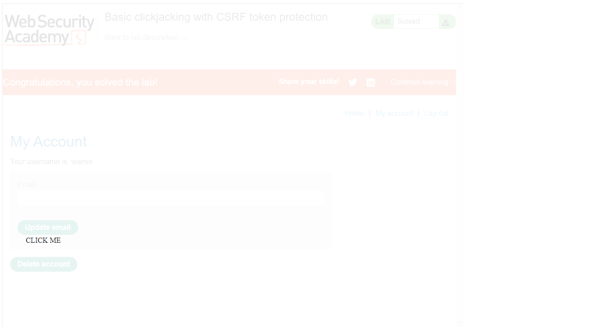
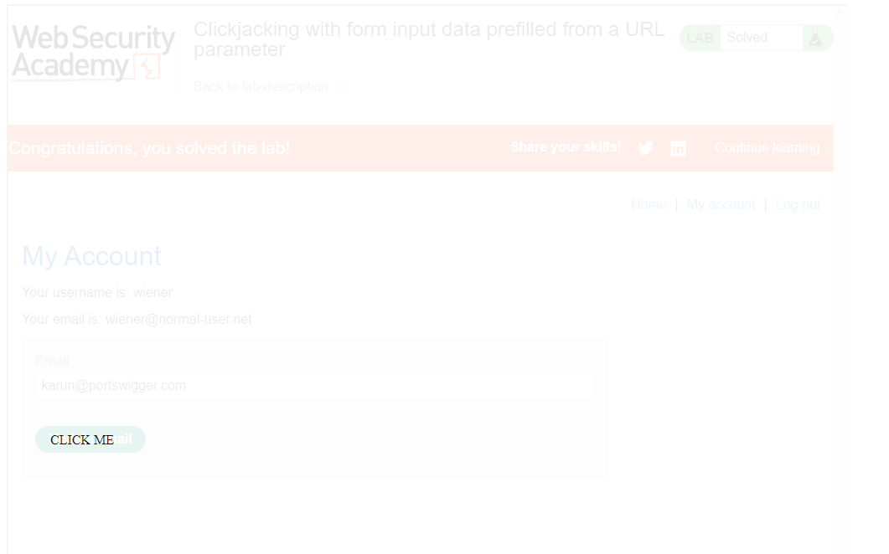
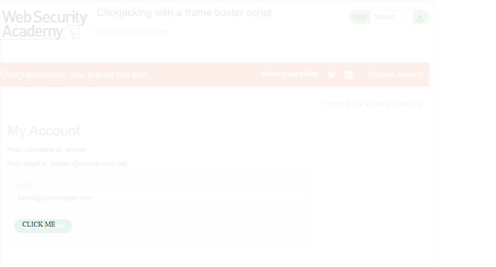
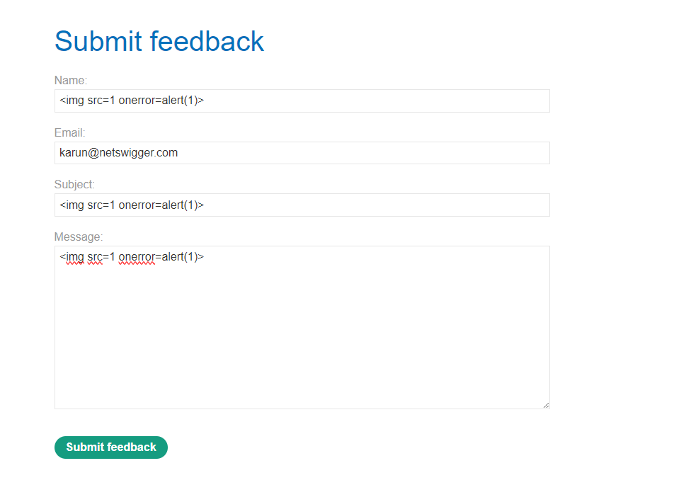
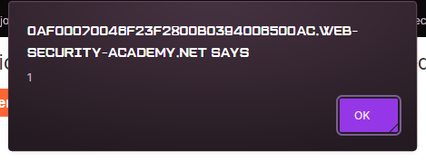
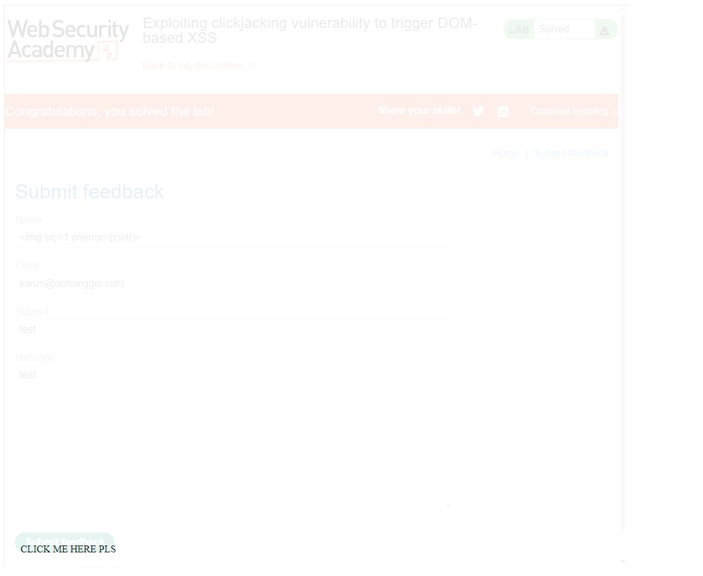
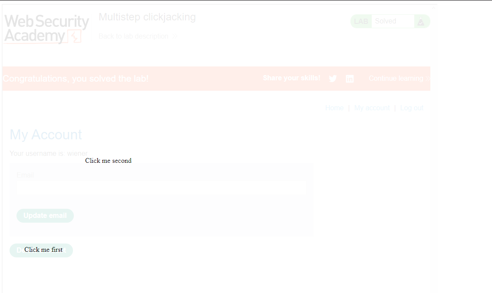

#### What is clickjacking?

Clickjacking is an interface-based attack in which a user is tricked into clicking on actionable content on a hidden website by clicking on some other content in a decoy website.The technique depends upon the incorporation of an invisible, actionable web page (or multiple pages) containing a button or hidden link, say, within an iframe. The iframe is overlaid on top of the user's anticipated decoy web page content. This attack differs from a CSRF attack in that the user is required to perform an action such as a button click whereas a CSRF attack depends upon forging an entire request without the user's knowledge or input.

Protection against CSRF attacks is often provided by the use of a CSRF token: a session-specific, single-use number or nonce. Clickjacking attacks are not mitigated by the CSRF token as a target session is established with content loaded from an authentic website and with all requests happening on-domain. CSRF tokens are placed into requests and passed to the server as part of a normally behaved session. The difference compared to a normal user session is that the process occurs within a hidden iframe.

#### How to construct a basic clickjacking attack

An example using the style tag and parameters is as follows:

```
<head>
	<style>
		#target_website {
			position:relative;
			width:128px;
			height:128px;
			opacity:0.00001;
			z-index:2;
			}
		#decoy_website {
			position:absolute;
			width:300px;
			height:400px;
			z-index:1;
			}
	</style>
</head>
...
<body>
	<div id="decoy_website">
	...decoy web content here...
	</div>
	<iframe id="target_website" src="https://vulnerable-website.com">
	</iframe>
</body>
```

#### Lab: Basic clickjacking with CSRF token protection

We can use the this web [exploit](https://github.com/RealGameTheory/Portswigger/blob/main/Clickjacking/exp1_lab1.html)

<br>

</br>


#### Lab: Clickjacking with form input data prefilled from a URL parameter

We can use the this web [exploit](https://github.com/RealGameTheory/Portswigger/blob/main/Clickjacking/exp2_lab2.html)

<br>

</br>

#### Frame busting scripts

Clickjacking attacks are possible whenever websites can be framed. Therefore, preventative techniques are based upon restricting the framing capability for websites. A common client-side protection enacted through the web browser is to use frame busting or frame breaking scripts. These can be implemented via proprietary browser JavaScript add-ons or extensions such as NoScript. Scripts are often crafted so that they perform some or all of the following behaviors:

* check and enforce that the current application window is the main or top window
* make all frames visible
* prevent clicking on invisible frames
* intercept and flag potential clickjacking attacks to the user

An effective attacker workaround against frame busters is to use the HTML5 iframe sandbox attribute. When this is set with the `allow-forms` or `allow-scripts` values and the `allow-top-navigation` value is omitted then the frame buster script can be neutralized as the iframe cannot check whether or not it is the top window:

`<iframe id="victim_website" src="https://victim-website.com" sandbox="allow-forms"></iframe>`

#### Lab: Clickjacking with a frame buster script

We can use the this web [exploit](https://github.com/RealGameTheory/Portswigger/blob/main/Clickjacking/exp3_lab3.html)

<br>

</br>

**Combining clickjacking with a DOM XSS attack**
The XSS exploit is combined with the iframe target URL so that the user clicks on the button or link and consequently executes the DOM XSS attack.

#### Lab: Exploiting clickjacking vulnerability to trigger DOM-based XSS

Trying out to see if XSS is possible in the feedback form

<br>

</br>

The XSS working:

<br>

</br>

We can use the this web [exploit](https://github.com/RealGameTheory/Portswigger/blob/main/Clickjacking/exp4_lab4.html)

<br>

</br>

#### Multistep clickjacking

Attacker manipulation of inputs to a target website may necessitate multiple actions. For example, an attacker might want to trick a user into buying something from a retail website so items need to be added to a shopping basket before the order is placed. These actions can be implemented by the attacker using multiple divisions or iframes. Such attacks require considerable precision and care from the attacker perspective if they are to be effective and stealthy.

#### Lab: Multistep clickjacking

We can use the this web [exploit](https://github.com/RealGameTheory/Portswigger/blob/main/Clickjacking/exp5_lab5.html)


<br>

</br>

<br>

</br>
