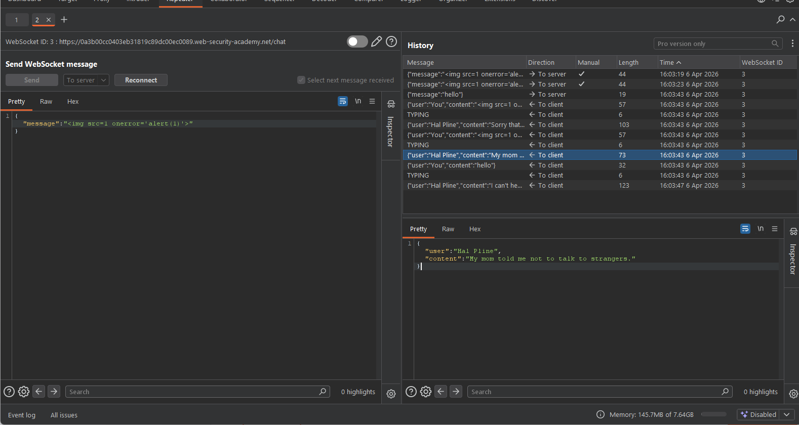
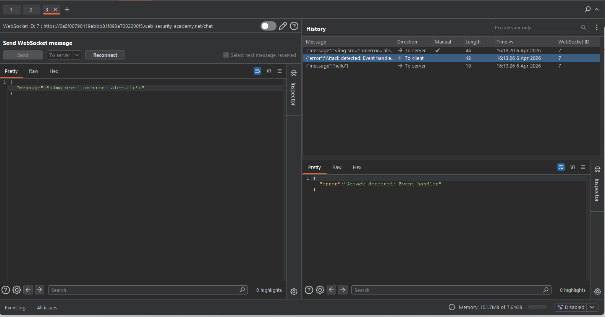
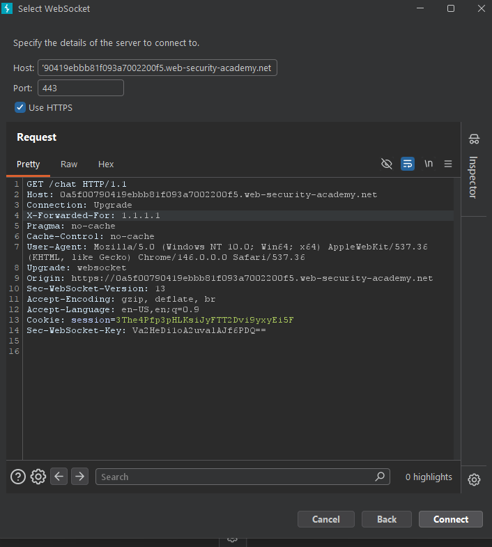
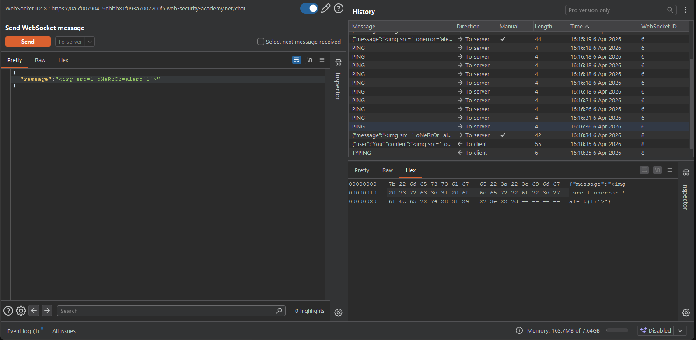
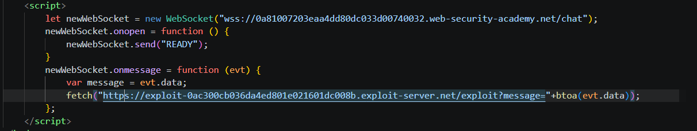
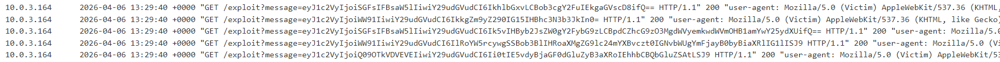
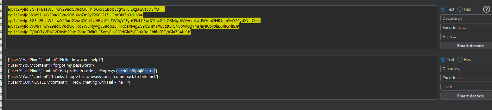
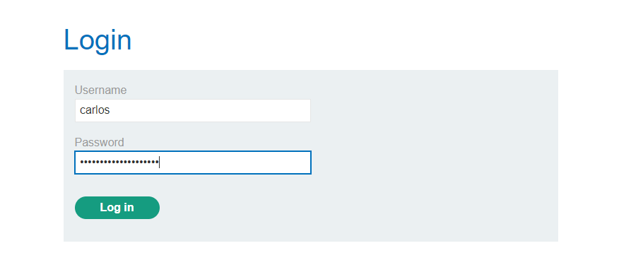

## WebSockets
WebSockets are widely used in modern web applications. They are initiated over HTTP and provide long-lived connections with asynchronous communication in both directions.

WebSockets are used for all kinds of purposes, including performing user actions and transmitting sensitive information. Virtually any web security vulnerability that arises with regular HTTP can also arise in relation to WebSockets communications.

> Note: Browse to the application function that uses WebSockets. You can determine that WebSockets are being used by using the application and looking for entries appearing in the WebSockets history tab within Burp Proxy.<br>

> Note: We can configure whether client-to-server or server-to-client messages are intercepted in Burp Proxy. Do this in the Settings dialog, in the WebSocket interception rules settings.

## WebSockets security vulnerabilities

In principle, practically any web security vulnerability might arise in relation to WebSockets:

* User-supplied input transmitted to the server might be processed in unsafe ways, leading to vulnerabilities such as SQL injection or XML external entity injection.
* Some blind vulnerabilities reached via WebSockets might only be detectable using out-of-band (OAST) techniques.
* If attacker-controlled data is transmitted via WebSockets to other application users, then it might lead to XSS or other client-side vulnerabilities.

## Manipulating WebSocket messages to exploit vulnerabilities

The majority of input-based vulnerabilities affecting WebSockets can be found and exploited by tampering with the contents of WebSocket messages.

For example, suppose a chat application uses WebSockets to send chat messages between the browser and the server. When a user types a chat message, a WebSocket message like the following is sent to the server:<br>
`{"message":"Hello Carlos"}`<br>

The contents of the message are transmitted (again via WebSockets) to another chat user, and rendered in the user's browser as follows:<br>
`<td>Hello Carlos</td>`<br>

In this situation, provided no other input processing or defenses are in play, an attacker can perform a proof-of-concept XSS attack by submitting the following WebSocket message:<br>
`{"message":""}`<br>

## Lab: Manipulating WebSocket messages to exploit vulnerabilities
First use intercept and get the message.

<br>

</br>

## Manipulating the WebSocket handshake to exploit vulnerabilities

Some WebSockets vulnerabilities can only be found and exploited by manipulating the WebSocket handshake. These vulnerabilities tend to involve design flaws, such as:

* Misplaced trust in HTTP headers to perform security decisions, such as the `X-Forwarded-For` header.
* Flaws in session handling mechanisms, since the session context in which WebSocket messages are processed is generally determined by the session context of the handshake message.
* Attack surface introduced by custom HTTP headers used by the application.

## Lab: Manipulating the WebSocket handshake to exploit vulnerabilities
First I do this: <br>

<br>

</br>

Due to which my IP gets blacklisted. Hence we use `X-Forwarded-For` to bypass the blacklisting

<br>

</br>

Then finally I execute the same payload as the first but by changing the letter casings which bypass the XSS checker:

<br>

</br>

## Using cross-site WebSockets to exploit vulnerabilities

Some WebSockets security vulnerabilities arise when an attacker makes a cross-domain WebSocket connection from a web site that the attacker controls. This is known as a cross-site WebSocket hijacking attack, and it involves exploiting a cross-site request forgery (CSRF) vulnerability on a WebSocket handshake. The attack often has a serious impact, allowing an attacker to perform privileged actions on behalf of the victim user or capture sensitive data to which the victim user has access.

## What is cross-site WebSocket hijacking?

Cross-site WebSocket hijacking (also known as cross-origin WebSocket hijacking) involves a cross-site request forgery (CSRF) vulnerability on a WebSocket handshake. It arises when the WebSocket handshake request relies solely on HTTP cookies for session handling and does not contain any CSRF tokens or other unpredictable values.

An attacker can create a malicious web page on their own domain which establishes a cross-site WebSocket connection to the vulnerable application. The application will handle the connection in the context of the victim user's session with the application.

The attacker's page can then send arbitrary messages to the server via the connection and read the contents of messages that are received back from the server. This means that, unlike regular CSRF, the attacker gains two-way interaction with the compromised application.

## What is the impact of cross-site WebSocket hijacking?

A successful cross-site WebSocket hijacking attack will often enable an attacker to:

* Perform unauthorized actions masquerading as the victim user. As with regular CSRF, the attacker can send arbitrary messages to the server-side application. If the application uses client-generated WebSocket messages to perform any sensitive actions, then the attacker can generate suitable messages cross-domain and trigger those actions.
* Retrieve sensitive data that the user can access. Unlike with regular CSRF, cross-site WebSocket hijacking gives the attacker two-way interaction with the vulnerable application over the hijacked WebSocket. If the application uses server-generated WebSocket messages to return any sensitive data to the user, then the attacker can intercept those messages and capture the victim user's data.

> **Note**:In terms of the normal conditions for CSRF attacks, you typically need to find a handshake message that relies solely on HTTP cookies for session handling and doesn't employ any tokens or other unpredictable values in request parameters.

## Performing a cross-site WebSocket hijacking attack
The following WebSocket handshake request is probably vulnerable to CSRF, because the only session token is transmitted in a cookie:
```
GET /chat HTTP/1.1
Host: normal-website.com
Sec-WebSocket-Version: 13
Sec-WebSocket-Key: wDqumtseNBJdhkihL6PW7w==
Connection: keep-alive, Upgrade
Cookie: session=KOsEJNuflw4Rd9BDNrVmvwBF9rEijeE2
Upgrade: websocket
```
>**Note:** The Sec-WebSocket-Key header contains a random value to prevent errors from caching proxies, and is not used for authentication or session handling purposes.

If the WebSocket handshake request is vulnerable to CSRF, then an attacker's web page can perform a cross-site request to open a WebSocket on the vulnerable site. What happens next in the attack depends entirely on the application's logic and how it is using WebSockets. The attack might involve:

* Sending WebSocket messages to perform unauthorized actions on behalf of the victim user.
* Sending WebSocket messages to retrieve sensitive data.
* Sometimes, just waiting for incoming messages to arrive containing sensitive data.

## Lab: Cross-site WebSocket hijacking
First we find out that the chat history is tied with the cookie.

First I create and [exploit](https://github.com/RealGameTheory/Portswigger/blob/main/websockets/exp1.html).

<br>

</br>

Then we find the messages in base64 form.

<br>

</br>

Then we decrypt the messages to find the password for carlos.

<br>

</br>

Then we login to carlos's account.

<br>

</br>

>**Note**: Mitigations(https://portswigger.net/web-security/learning-paths/websockets-security-vulnerabilities/how-to-secure-a-websocket-connection/websockets/how-to-secure-a-websocket-connection)
